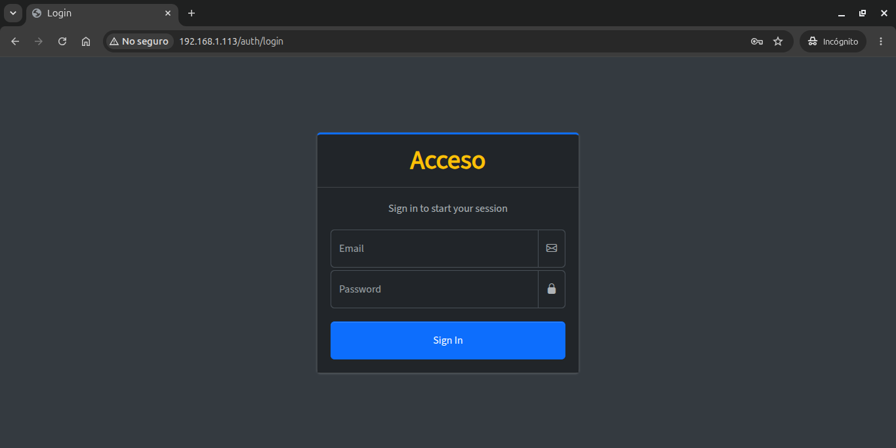
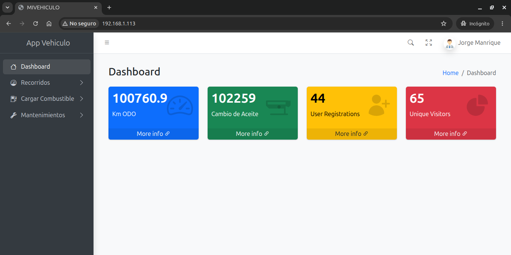
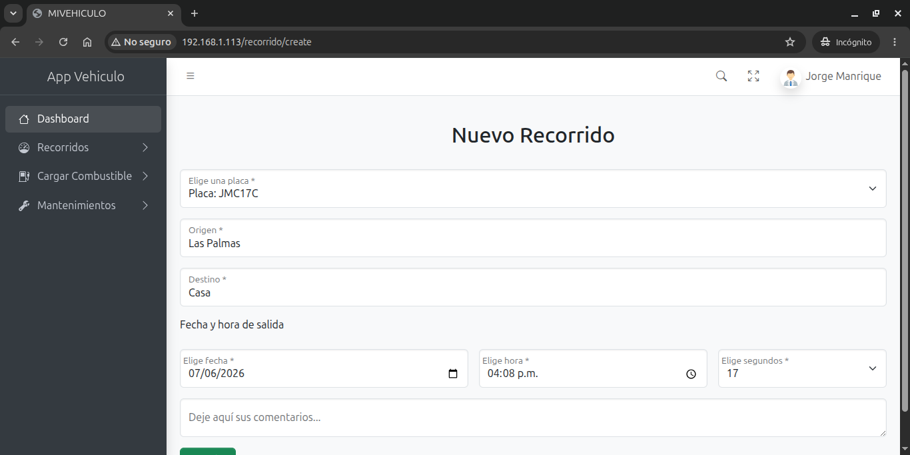
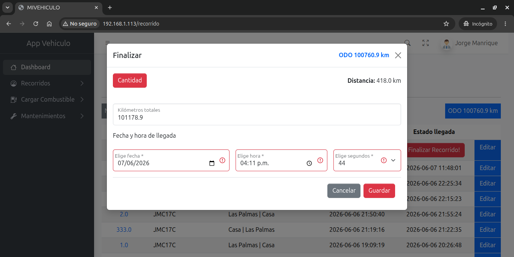
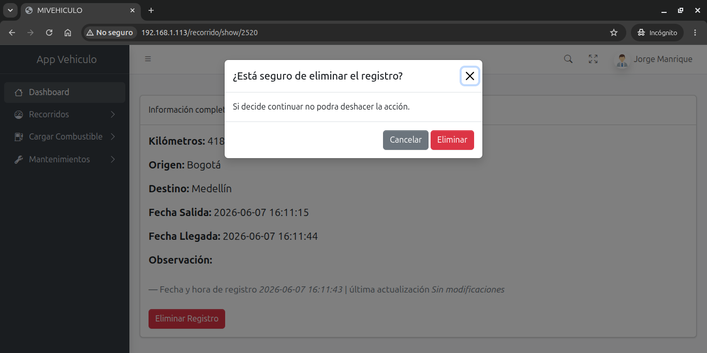
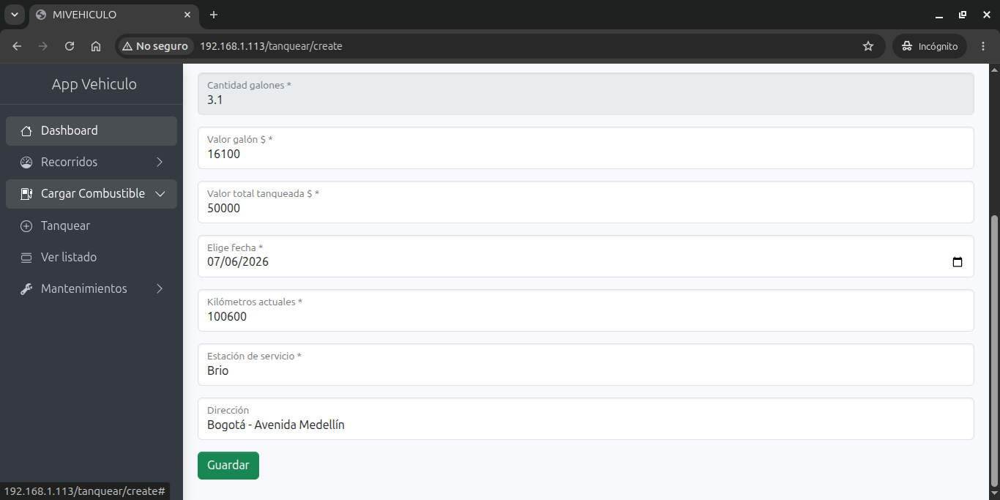
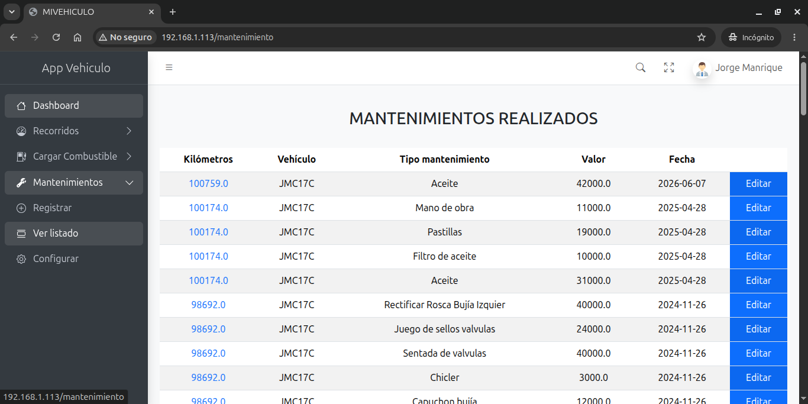

# MiVehiculo

Aplicación web en PHP basada en un mini framework propio para gestionar vehículos, recorridos, mantenimiento y tanques de combustible.

## Descripción

MiVehiculo es una solución ligera que implementa una arquitectura MVC mínima con controladores, modelos y vistas en PHP. Está orientada a proyectos del tipo administrativo donde se requieren funcionalidades de autenticación, control de mantenimiento, registro de recorridos y gestión de carga de combustible.


## Capturas de pantalla

- **Login**
  

- **Dashboard**
  

- **Nuevo recorrido**
  

- **Finaliza recorrido**
  

- **Eliminar recorrido (modal)**
  

- **Tanquear**
  

- **Listado de mantenimientos**
  

## Características

- Inicio de sesión y control de sesión de usuario
- Gestión de vehículos
- Registro y consulta de mantenimientos
- Gestión de recorridos y cálculo de cambio de aceite
- Registro de tanques de combustible
- Interfaz de usuario implementada con AdminLTE 4
- Vista de páginas con plantillas PHP y recursos estáticos
- Arquitectura modular para ampliar con nuevas entidades

## Estructura del proyecto

- `app/`
  - `Http/Controllers/`: controladores de aplicación
  - `Libraries/Core/`: núcleo del framework con clases para controladores, conexión a base de datos, request/response y vista
  - `Models/`: modelos del dominio (por ejemplo, `Vehiculo`, `Mantenimiento`, `Recorrido`, `Tanquear`)
  - `helpers.php`: funciones auxiliares globales
- `config/`
  - `config.php`: carga de configuración, zona horaria y arranque de sesión
  - `db_config.php`: configuración de acceso a la base de datos (no incluida en el control de versiones)
  - `db_config_example.php`: ejemplo de configuración de la base de datos
  - `rutas_directorios.php`: definiciones de rutas y directorios del proyecto
  - `zona_horaria.php`: configuración de zona horaria
- `public/`
  - `index.php`: punto de entrada público
  - `css/`, `js/`, `img/`: recursos estáticos para el frontend
- `resources/Views/`: vistas y plantillas de la aplicación
- `vendor/`: dependencias y autoload de Composer
- `db_script.sql`: script de base de datos para crear la estructura necesaria

## Requisitos

- PHP 7.4 o superior
- Servidor web compatible (Apache, Nginx, etc.)
- MySQL o MariaDB
- Composer

## Instalación

1. Clonar o copiar el repositorio en el directorio del servidor web.

2. Instalar dependencias de Composer:

```bash
composer install
```

3. Generar el archivo de configuración de base de datos a partir del ejemplo:

```bash
cp config/db_config_example.php config/db_config.php
```

4. Editar `config/db_config.php` con los datos reales de conexión:

```php
const DB_HOST = "localhost";
const DB_DATABASE = "nombre_base_de_datos";
const DB_USER = "usuario";
const DB_PASSWORD = "contraseña";
const DB_CHARACTER = "utf8";
```

5. Proteger el directorio de configuración y usar `public/` como raíz pública del servidor.

6. Importar la base de datos con `db_script.sql` o su propio script SQL:

```bash
mysql -u usuario -p nombre_base_de_datos < db_script.sql
```

## Configuración adicional

- `config/config.php` arranca la sesión y define constantes `USER_ID` y `USER` a partir de la sesión.
- `config/rutas_directorios.php` define `APP`, `Views`, `RUTA` y `Assets` para el uso de rutas internas.
- `public/index.php` controla si hay usuario autenticado y carga el encabezado, el pie y la vista correspondiente.

## Uso

1. Acceder al proyecto desde el navegador apuntando a la carpeta `public/`.
2. Iniciar sesión en la página de autenticación.
3. Navegar por el menú para gestionar vehículos, mantenimientos, recorridos y tanques.
4. Agregar o editar registros desde las vistas disponibles.

## Contribución

- Crear una rama descriptiva antes de modificar el código.
- Mantener la coherencia de la arquitectura MVC existente.
- Añadir nuevas vistas bajo `resources/Views/` y nuevos controladores en `app/Http/Controllers/`.
- Probar los cambios localmente antes de subirlos.

## Autor

- [Jorge Manrique](https://github.com/jmanriquecha)

## Licencia

Este proyecto está licenciado bajo la licencia MIT. Consulta el archivo [LICENSE](LICENSE) para más detalles.